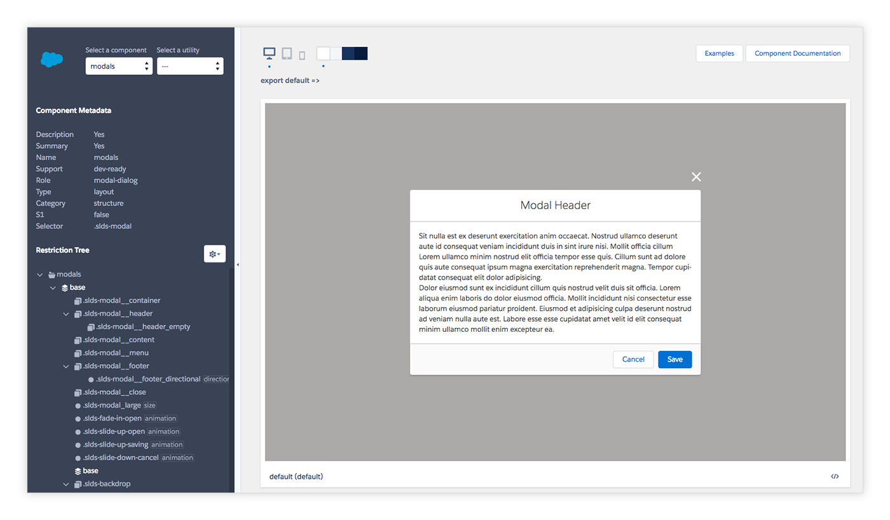

# Salesforce Lightning Design System [](https://travis-ci.org/salesforce-ux/design-system)

Welcome to the [Salesforce Lightning Design System](https://www.lightningdesignsystem.com) brought to you by [Salesforce UX](https://twitter.com/salesforceux).

* Tailored for building Salesforce apps: Using the Lightning Design System markup and CSS framework results in UIs that reflect the Salesforce Lightning look and feel.
* Continuously updated: As long as you’re using the latest version of the Lightning Design System, your pages are always up to date with Salesforce UI changes.

## Quick start

1. Clone the project with `git clone https://github.com/salesforce-ux/design-system.git`
2. Run `npm install` in the root design-system folder.
3. Run `npm start` to launch the Previewer.
4. Visit http://localhost:3003/local/preview

Having trouble getting these steps to work on your machine? Follow the [troubleshooting](#troubleshooting) guide below.


## Previewer



The previewer is an interactive tool for creating components.

It runs at the designated url on startup and is the primary means of viewing your work - it will live update as you make changes.

You can choose the component, variant, and modifiers to preview as well as background color and screen size. It also previews the sass docs.

Everything in the design system is driven by [annotations](#annotations) and the previewer is no different. **To see any work in the previewer, you must add annotations to your code.**


## Annotations

Annotations are the metadata that describe the entire system.

The most intriguing part is the `@selector/@restrict` pair. Each CSS selector should have a corresponding selector describing where it can be applied. Both are normal CSS selectors that will behave like a DOM query.

For example:

```SCSS
/**
 * @selector .slds-button
 * @restrict button, a, span
 */
.slds-button {
  ...
}

/**
 * @selector .slds-button_brand
 * @restrict .slds-button
 */
.slds-button_brand {
  ...
}
```

In this example we can see that `.slds-button_brand` must be applied to a `.slds-button`, which, in turn, must be applied to a `button, a, span`.

It's important to know that `slds-button_brand` will only be associated to the button component via this `@restrict` chain. Each rule uses its `@restrict` to declare its place in the hierarchy - **it is not the the file that tells us to which component a selector belongs**

For a more complex example, see: https://github.com/salesforce-ux/design-system-internal/blob/summer-17/ui/components/combobox/base/_index.scss

While there is a handful of annotations used throughout the codebase, you'll only need to know a few to get started:

* `@base`: creates a new component
* `@variant`: a component implementation with corresponding markup
* `@modifier`: a class that alters appearance when applied to existing markup


The markup for a `@variant` will be required from the `/ui/:component/:variant/example.jsx`.

For example:

```SCSS
/**
 * @name advanced
 * @selector .slds-table_fixed-layout
 * @restrict .slds-table
 * @variant
 */

```

**Folder Structure:**

```
ui/
└── components/
    └── data-tables/
        ├── _doc.scss
        ├── _doc.mdx
        └── advanced/
            └── example.jsx
            └── _index.scss

```

All other selectors which are not `@base/@variant/@modifier` are considered child elements of a component.

For more information see the [Full annotation docs](https://github.com/salesforce-ux/design-system-internal/wiki/Documentation-Styleguide)


## Tasks

### `npm start`

Start the Lightning Design System preview app.

### `npm run gulp -- lint`

Lint the code base for syntax and stylistic errors.

```bash
# Lint indentation, Sass, JavaScript files
npm run gulp -- lint

# Lint languagesindependently
npm run gulp -- lint:sass
npm run gulp -- lint:javascript
npm run gulp -- lint:javascript:test
npm run gulp -- lint:spaces
npm run gulp -- lint:html

# HTML5 validation
npm run gulp -- lint:vnu
# HTML5 validation on comma separated component names
npm run gulp -- lint:vnu --components button, path, trees

# a11y validation
npm run gulp -- lint:a11y
# a11y validation on comma separated component names
npm run gulp -- lint:a11y --components button, path, trees

# Lint examples using vnu, aXe, slds validation, and HTML5 validation
npm run gulp -- lint:examples
```

### Compilation

### `npm run build && npm run dist`

Generate the Lightning Design System into the `.dist` directory.

### `npm run gulp -- styles`

Compile Sass to CSS into `.assets/styles`.

### `npm run gulp -- clean`

Delete temporary build and local files.

### Stats

`npm run gulp -- styles:stats`: Useful stats about the project's deliverables.

### Tests

`npm test`: run all tests

## Troubleshooting

### npm and Node.js

The Salesforce Lightning Design System uses `npm` to manage dependencies. Please [install Node.js](https://nodejs.org), and try running `npm install` again.

If Node.js is already installed, make sure you’re running v8 or up.

### JavaScript and compilation issues

JavaScript dependencies sometimes get out of sync and inexplicable bugs start to happen. Follow these steps to give a fresh start to your development environment:

1. The installed `npm` version must be at least v3.10. You can update your npm with: `npm install npm -g` (`sudo` may be required).
2. Re-install dependencies: `rm -Rf node_modules && npm install`
3. `npm start`

If this did not work, try running `npm cache clean` and repeat the above steps.

## Contributing to the code base

See <a href="CONTRIBUTING.md">CONTRIBUTING.md</a>.

## Licenses

* Source code is licensed under [BSD 3-Clause](https://git.io/sfdc-license)
* All icons and images are licensed under [Creative Commons Attribution-NoDerivatives 4.0](https://github.com/salesforce-ux/licenses/blob/master/LICENSE-icons-images.txt)
* The Salesforce Sans font is licensed under our [font license](https://github.com/salesforce-ux/licenses/blob/master/LICENSE-font.txt)

## Got feedback?

Please open a new <a href="https://github.com/salesforce-ux/design-system/issues">GitHub Issue</a>.
